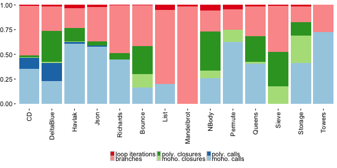
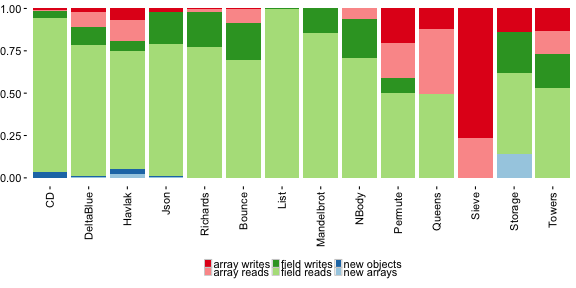
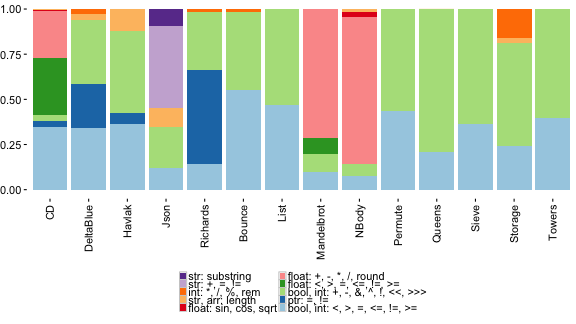

Benchmark Characterization
==========================

## Code Size Statistics

The following metrics characterize the size of the benchmarks. The numbers are
based on the SOMns benchmark implementations, but should be similar to the
numbers one would measure for the other languages.

##### Executed Lines of Code

Compared to the classic notion of lines of code (LOC), we count only lines of
code that have been executed at least once to measure the dynamic size of the
program instead of its static size.

##### Classes

The number of classes includes only classes of which at least one method was
executed. It is stable across languages with the exception of JavaScript which
does not use classes in the version of the language used for this work.

##### Executed Methods

Similar to counting executed LOC, we count methods that have been executed at
least once.

##### Per Iteration Methods

In addition to executed methods, we further distinguish methods that are
executed for each benchmark iteration. Thus, we separate out code that was only
executed once during startup or shutdown. The number of per iteration methods
indicates the methods that get likely compiled during benchmarking.

<table frame="hsides" rules="groups">
<thead>
<tr class="center">
  <th></th>
  <th>Executed Lines</th>
  <th>Classes</th>
  <th>Executed Methods</th>
  <th>Per Iteration Methods</th>
</tr>
</thead>
<tbody>
<tr class="center">
  <th class="left">CD</th>
  <td class="right">356</td>
  <td class="right">16</td>
  <td class="right"> 43</td>
  <td class="right">41</td>
</tr>
 <tr class="center">
  <th class="left">DeltaBlue</th>
  <td class="right">387</td>
  <td class="right">20</td>
  <td class="right"> 99</td>
  <td class="right">75</td>
</tr>
 <tr class="center">
  <th class="left">Havlak</th>
  <td class="right">421</td>
  <td class="right">18</td>
  <td class="right">110</td>
  <td class="right">87</td>
</tr>
 <tr class="center">
  <th class="left">Json</th>
  <td class="right">232</td>
  <td class="right">14</td>
  <td class="right"> 56</td>
  <td class="right">56</td>
</tr>
 <tr class="center">
  <th class="left">Richards</th>
  <td class="right">279</td>
  <td class="right">12</td>
  <td class="right"> 47</td>
  <td class="right">47</td>
</tr>
 <tr class="center">
  <th class="left">Bounce</th>
  <td class="right"> 42</td>
  <td class="right"> 5</td>
  <td class="right"> 11</td>
  <td class="right">11</td>
</tr>
 <tr class="center">
  <th class="left">List</th>
  <td class="right"> 30</td>
  <td class="right"> 2</td>
  <td class="right">  9</td>
  <td class="right"> 9</td>
</tr>
 <tr class="center">
  <th class="left">Mandelbrot</th>
  <td class="right"> 39</td>
  <td class="right"> 0</td>
  <td class="right">  2</td>
  <td class="right"> 2</td>
</tr>
 <tr class="center">
  <th class="left">NBody</th>
  <td class="right">105</td>
  <td class="right"> 3</td>
  <td class="right"> 14</td>
  <td class="right">14</td>
</tr>
 <tr class="center">
  <th class="left">Permute</th>
  <td class="right"> 33</td>
  <td class="right"> 3</td>
  <td class="right"> 13</td>
  <td class="right">13</td>
</tr>
 <tr class="center">
  <th class="left">Queens</th>
  <td class="right"> 36</td>
  <td class="right"> 3</td>
  <td class="right"> 13</td>
  <td class="right">13</td>
</tr>
 <tr class="center">
  <th class="left">Sieve</th>
  <td class="right"> 22</td>
  <td class="right"> 3</td>
  <td class="right">  9</td>
  <td class="right"> 9</td>
</tr>
 <tr class="center">
  <th class="left">Storage</th>
  <td class="right"> 23</td>
  <td class="right"> 4</td>
  <td class="right"> 10</td>
  <td class="right">10</td>
</tr>
 <tr class="center">
  <th class="left">Towers</th>
  <td class="right"> 42</td>
  <td class="right"> 2</td>
  <td class="right"> 12</td>
  <td class="right">12</td>
</tr>
</tbody>
</table>

## Dynamic Metrics

The dynamic metrics characterize the behavior of the benchmarks in more detail.

##### Method Calls

For method calls, we count at each call site, i.e., the lexical point in the
program where a call is made, the number of different receiver types, as well as
the number of different target methods that were activated at that point. The
number of target methods should always be smaller or equal to the number of
different receiver types.

Operators such as `+` or `*` are excluded from the method call count.

Observed receiver polymorphism, i.e., different observed receiver
types/classes:

<table frame="hsides" rules="groups">
<thead>
<tr class="center">
  <th></th>
  <th>Num.Rcvrs</th>
  <th>Call Sites</th>
  <th>Calls</th>
</tr>
</thead>
<tbody>
<tr class="center">
  <th class="left">CD</th>
  <th class="left">1</th>
  <td class="right">166</td>
  <td class="right">75,892,212</td>
</tr>
 <tr class="center">
  <th class="left">&nbsp;</th>
  <th class="left">2</th>
  <td class="right">  3</td>
  <td class="right">23,151,272</td>
</tr>
 <tr class="center">
  <th class="left">DeltaBlue</th>
  <th class="left">1</th>
  <td class="right">171</td>
  <td class="right"> 6,219,974</td>
</tr>
 <tr class="center">
  <th class="left">&nbsp;</th>
  <th class="left">2</th>
  <td class="right">  8</td>
  <td class="right">   480,130</td>
</tr>
 <tr class="center">
  <th class="left">&nbsp;</th>
  <th class="left">3</th>
  <td class="right">  8</td>
  <td class="right"> 3,576,416</td>
</tr>
 <tr class="center">
  <th class="left">&nbsp;</th>
  <th class="left">4</th>
  <td class="right">  7</td>
  <td class="right">   840,146</td>
</tr>
 <tr class="center">
  <th class="left">Havlak</th>
  <th class="left">1</th>
  <td class="right">256</td>
  <td class="right">79,581,122</td>
</tr>
 <tr class="center">
  <th class="left">&nbsp;</th>
  <th class="left">2</th>
  <td class="right">  3</td>
  <td class="right"> 2,720,556</td>
</tr>
 <tr class="center">
  <th class="left">Json</th>
  <th class="left">1</th>
  <td class="right">163</td>
  <td class="right">32,115,418</td>
</tr>
 <tr class="center">
  <th class="left">&nbsp;</th>
  <th class="left">5</th>
  <td class="right">  2</td>
  <td class="right">   678,200</td>
</tr>
 <tr class="center">
  <th class="left">Richards</th>
  <th class="left">1</th>
  <td class="right">108</td>
  <td class="right">95,521,018</td>
</tr>
 <tr class="center">
  <th class="left">&nbsp;</th>
  <th class="left">2</th>
  <td class="right">  2</td>
  <td class="right">    10,000</td>
</tr>
 <tr class="center">
  <th class="left">Bounce</th>
  <th class="left">1</th>
  <td class="right"> 31</td>
  <td class="right">17,736,018</td>
</tr>
 <tr class="center">
  <th class="left">List</th>
  <th class="left">1</th>
  <td class="right"> 28</td>
  <td class="right">17,271,018</td>
</tr>
 <tr class="center">
  <th class="left">Mandelbrot</th>
  <th class="left">1</th>
  <td class="right"> 10</td>
  <td class="right">        16</td>
</tr>
 <tr class="center">
  <th class="left">NBody</th>
  <th class="left">1</th>
  <td class="right"> 38</td>
  <td class="right"> 8,500,102</td>
</tr>
 <tr class="center">
  <th class="left">Permute</th>
  <th class="left">1</th>
  <td class="right"> 25</td>
  <td class="right">51,982,018</td>
</tr>
 <tr class="center">
  <th class="left">Queens</th>
  <th class="left">1</th>
  <td class="right"> 28</td>
  <td class="right">29,088,018</td>
</tr>
 <tr class="center">
  <th class="left">Sieve</th>
  <th class="left">1</th>
  <td class="right"> 19</td>
  <td class="right">    60,018</td>
</tr>
 <tr class="center">
  <th class="left">Storage</th>
  <th class="left">1</th>
  <td class="right"> 23</td>
  <td class="right">32,774,018</td>
</tr>
 <tr class="center">
  <th class="left">Towers</th>
  <th class="left">1</th>
  <td class="right"> 27</td>
  <td class="right">39,390,018</td>
</tr>
</tbody>
</table>

Observed target polymorphism, i.e., different activated methods:

<table frame="hsides" rules="groups">
<thead>
<tr class="center">
  <th></th>
  <th>Num.Targets</th>
  <th>Call Sites</th>
  <th>Calls</th>
</tr>
</thead>
<tbody>
<tr class="center">
  <th class="left">CD</th>
  <th class="left">1</th>
  <td class="right">166</td>
  <td class="right">75,892,212</td>
</tr>
 <tr class="center">
  <th class="left">&nbsp;</th>
  <th class="left">2</th>
  <td class="right">  3</td>
  <td class="right">23,151,272</td>
</tr>
 <tr class="center">
  <th class="left">DeltaBlue</th>
  <th class="left">1</th>
  <td class="right">180</td>
  <td class="right"> 6,892,136</td>
</tr>
 <tr class="center">
  <th class="left">&nbsp;</th>
  <th class="left">2</th>
  <td class="right"> 10</td>
  <td class="right">   936,150</td>
</tr>
 <tr class="center">
  <th class="left">&nbsp;</th>
  <th class="left">3</th>
  <td class="right">  4</td>
  <td class="right"> 3,288,380</td>
</tr>
 <tr class="center">
  <th class="left">Havlak</th>
  <th class="left">1</th>
  <td class="right">257</td>
  <td class="right">80,439,690</td>
</tr>
 <tr class="center">
  <th class="left">&nbsp;</th>
  <th class="left">2</th>
  <td class="right">  2</td>
  <td class="right"> 1,861,988</td>
</tr>
 <tr class="center">
  <th class="left">Json</th>
  <th class="left">1</th>
  <td class="right">165</td>
  <td class="right">32,793,618</td>
</tr>
 <tr class="center">
  <th class="left">Richards</th>
  <th class="left">1</th>
  <td class="right">110</td>
  <td class="right">95,531,018</td>
</tr>
 <tr class="center">
  <th class="left">Bounce</th>
  <th class="left">1</th>
  <td class="right"> 31</td>
  <td class="right">17,736,018</td>
</tr>
 <tr class="center">
  <th class="left">List</th>
  <th class="left">1</th>
  <td class="right"> 28</td>
  <td class="right">17,271,018</td>
</tr>
 <tr class="center">
  <th class="left">Mandelbrot</th>
  <th class="left">1</th>
  <td class="right"> 10</td>
  <td class="right">        16</td>
</tr>
 <tr class="center">
  <th class="left">NBody</th>
  <th class="left">1</th>
  <td class="right"> 38</td>
  <td class="right"> 8,500,102</td>
</tr>
 <tr class="center">
  <th class="left">Permute</th>
  <th class="left">1</th>
  <td class="right"> 25</td>
  <td class="right">51,982,018</td>
</tr>
 <tr class="center">
  <th class="left">Queens</th>
  <th class="left">1</th>
  <td class="right"> 28</td>
  <td class="right">29,088,018</td>
</tr>
 <tr class="center">
  <th class="left">Sieve</th>
  <th class="left">1</th>
  <td class="right"> 19</td>
  <td class="right">    60,018</td>
</tr>
 <tr class="center">
  <th class="left">Storage</th>
  <th class="left">1</th>
  <td class="right"> 23</td>
  <td class="right">32,774,018</td>
</tr>
 <tr class="center">
  <th class="left">Towers</th>
  <th class="left">1</th>
  <td class="right"> 27</td>
  <td class="right">39,390,018</td>
</tr>
</tbody>
</table>

##### Closure Applications

Similar to method calls, we measure the number of lexical closures observed at a
closure application site. A closure application site is the lexical point where
a closure is executed.

<table frame="hsides" rules="groups">
<thead>
<tr class="center">
  <th></th>
  <th>Num.Targets</th>
  <th>Sites</th>
  <th>Activations</th>
</tr>
</thead>
<tbody>
<tr class="center">
  <th class="left">CD</th>
  <th class="left">1</th>
  <td class="right"> 2</td>
  <td class="right"> 1,345,202</td>
</tr>
 <tr class="center">
  <th class="left">&nbsp;</th>
  <th class="left">2</th>
  <td class="right"> 1</td>
  <td class="right">   677,440</td>
</tr>
 <tr class="center">
  <th class="left">&nbsp;</th>
  <th class="left">3</th>
  <td class="right"> 1</td>
  <td class="right">   872,694</td>
</tr>
 <tr class="center">
  <th class="left">&nbsp;</th>
  <th class="left">8</th>
  <td class="right"> 1</td>
  <td class="right"> 2,638,378</td>
</tr>
 <tr class="center">
  <th class="left">DeltaBlue</th>
  <th class="left">1</th>
  <td class="right">13</td>
  <td class="right">   336,022</td>
</tr>
 <tr class="center">
  <th class="left">&nbsp;</th>
  <th class="left">2</th>
  <td class="right"> 1</td>
  <td class="right">        82</td>
</tr>
 <tr class="center">
  <th class="left">&nbsp;</th>
  <th class="left">3</th>
  <td class="right"> 1</td>
  <td class="right">   447,442</td>
</tr>
 <tr class="center">
  <th class="left">&nbsp;</th>
  <th class="left">8</th>
  <td class="right"> 2</td>
  <td class="right"> 7,984,628</td>
</tr>
 <tr class="center">
  <th class="left">Havlak</th>
  <th class="left">1</th>
  <td class="right"> 1</td>
  <td class="right">   531,748</td>
</tr>
 <tr class="center">
  <th class="left">&nbsp;</th>
  <th class="left">2</th>
  <td class="right"> 1</td>
  <td class="right"> 1,701,912</td>
</tr>
 <tr class="center">
  <th class="left">&nbsp;</th>
  <th class="left">3</th>
  <td class="right"> 1</td>
  <td class="right"> 2,664,704</td>
</tr>
 <tr class="center">
  <th class="left">&nbsp;</th>
  <th class="left">6</th>
  <td class="right"> 1</td>
  <td class="right">     1,324</td>
</tr>
 <tr class="center">
  <th class="left">&nbsp;</th>
  <th class="left">9</th>
  <td class="right"> 2</td>
  <td class="right">13,571,016</td>
</tr>
 <tr class="center">
  <th class="left">Json</th>
  <th class="left">2</th>
  <td class="right"> 3</td>
  <td class="right"> 2,070,004</td>
</tr>
 <tr class="center">
  <th class="left">Richards</th>
  <th class="left">1</th>
  <td class="right"> 1</td>
  <td class="right">     7,600</td>
</tr>
 <tr class="center">
  <th class="left">&nbsp;</th>
  <th class="left">2</th>
  <td class="right"> 1</td>
  <td class="right">       202</td>
</tr>
 <tr class="center">
  <th class="left">&nbsp;</th>
  <th class="left">3</th>
  <td class="right"> 1</td>
  <td class="right"> 1,869,402</td>
</tr>
 <tr class="center">
  <th class="left">&nbsp;</th>
  <th class="left">4</th>
  <td class="right"> 1</td>
  <td class="right">13,158,000</td>
</tr>
 <tr class="center">
  <th class="left">Bounce</th>
  <th class="left">1</th>
  <td class="right"> 2</td>
  <td class="right">15,300,000</td>
</tr>
 <tr class="center">
  <th class="left">&nbsp;</th>
  <th class="left">2</th>
  <td class="right"> 2</td>
  <td class="right">15,303,002</td>
</tr>
 <tr class="center">
  <th class="left">&nbsp;</th>
  <th class="left">3</th>
  <td class="right"> 1</td>
  <td class="right">15,453,002</td>
</tr>
 <tr class="center">
  <th class="left">List</th>
  <th class="left">1</th>
  <td class="right"> 1</td>
  <td class="right">     3,002</td>
</tr>
 <tr class="center">
  <th class="left">&nbsp;</th>
  <th class="left">2</th>
  <td class="right"> 1</td>
  <td class="right">     3,002</td>
</tr>
 <tr class="center">
  <th class="left">Mandelbrot</th>
  <th class="left">1</th>
  <td class="right"> 2</td>
  <td class="right">         4</td>
</tr>
 <tr class="center">
  <th class="left">NBody</th>
  <th class="left">1</th>
  <td class="right"> 2</td>
  <td class="right"> 2,500,012</td>
</tr>
 <tr class="center">
  <th class="left">&nbsp;</th>
  <th class="left">2</th>
  <td class="right"> 1</td>
  <td class="right"> 2,500,010</td>
</tr>
 <tr class="center">
  <th class="left">&nbsp;</th>
  <th class="left">7</th>
  <td class="right"> 1</td>
  <td class="right">10,500,042</td>
</tr>
 <tr class="center">
  <th class="left">Permute</th>
  <th class="left">1</th>
  <td class="right"> 2</td>
  <td class="right">10,090,000</td>
</tr>
 <tr class="center">
  <th class="left">&nbsp;</th>
  <th class="left">2</th>
  <td class="right"> 2</td>
  <td class="right">    16,004</td>
</tr>
 <tr class="center">
  <th class="left">Queens</th>
  <th class="left">1</th>
  <td class="right"> 1</td>
  <td class="right">   960,000</td>
</tr>
 <tr class="center">
  <th class="left">&nbsp;</th>
  <th class="left">2</th>
  <td class="right"> 1</td>
  <td class="right">     2,002</td>
</tr>
 <tr class="center">
  <th class="left">&nbsp;</th>
  <th class="left">4</th>
  <td class="right"> 1</td>
  <td class="right">18,502,002</td>
</tr>
 <tr class="center">
  <th class="left">Sieve</th>
  <th class="left">1</th>
  <td class="right"> 1</td>
  <td class="right">30,000,000</td>
</tr>
 <tr class="center">
  <th class="left">&nbsp;</th>
  <th class="left">2</th>
  <td class="right"> 1</td>
  <td class="right">     6,002</td>
</tr>
 <tr class="center">
  <th class="left">&nbsp;</th>
  <th class="left">3</th>
  <td class="right"> 1</td>
  <td class="right">60,000,002</td>
</tr>
 <tr class="center">
  <th class="left">Storage</th>
  <th class="left">1</th>
  <td class="right"> 2</td>
  <td class="right">21,840,000</td>
</tr>
 <tr class="center">
  <th class="left">&nbsp;</th>
  <th class="left">2</th>
  <td class="right"> 2</td>
  <td class="right">10,924,004</td>
</tr>
 <tr class="center">
  <th class="left">Towers</th>
  <th class="left">1</th>
  <td class="right"> 2</td>
  <td class="right">    18,002</td>
</tr>
 <tr class="center">
  <th class="left">&nbsp;</th>
  <th class="left">2</th>
  <td class="right"> 1</td>
  <td class="right">     1,202</td>
</tr>
</tbody>
</table>

##### Maximum Stack Height

As an indication for the recursive behavior, we measure the maximal observed
stack height, i.e., the number of method activations on the runtime stack.

<table frame="hsides" rules="groups">
<thead>
<tr class="center">
  <th></th>
  <th>Max Stack Height</th>
</tr>
</thead>
<tbody>
<tr class="center">
  <th class="left">CD</th>
  <td class="right">  35</td>
</tr>
 <tr class="center">
  <th class="left">DeltaBlue</th>
  <td class="right">  37</td>
</tr>
 <tr class="center">
  <th class="left">Havlak</th>
  <td class="right">1717</td>
</tr>
 <tr class="center">
  <th class="left">Json</th>
  <td class="right">  43</td>
</tr>
 <tr class="center">
  <th class="left">Richards</th>
  <td class="right">  31</td>
</tr>
 <tr class="center">
  <th class="left">Bounce</th>
  <td class="right">  30</td>
</tr>
 <tr class="center">
  <th class="left">List</th>
  <td class="right">  37</td>
</tr>
 <tr class="center">
  <th class="left">Mandelbrot</th>
  <td class="right">  15</td>
</tr>
 <tr class="center">
  <th class="left">NBody</th>
  <td class="right">  24</td>
</tr>
 <tr class="center">
  <th class="left">Permute</th>
  <td class="right">  44</td>
</tr>
 <tr class="center">
  <th class="left">Queens</th>
  <td class="right">  56</td>
</tr>
 <tr class="center">
  <th class="left">Sieve</th>
  <td class="right">  26</td>
</tr>
 <tr class="center">
  <th class="left">Storage</th>
  <td class="right">  75</td>
</tr>
 <tr class="center">
  <th class="left">Towers</th>
  <td class="right">  34</td>
</tr>
</tbody>
</table>

##### Loops

We count loops that have been activated at least once. Furthermore, we count the
number of times a loop body has been executed.

<table frame="hsides" rules="groups">
<thead>
<tr class="center">
  <th></th>
  <th>Loops</th>
  <th>Iterations</th>
</tr>
</thead>
<tbody>
<tr class="center">
  <th class="left">CD</th>
  <td class="right">7</td>
  <td class="right">2,314,044</td>
</tr>
 <tr class="center">
  <th class="left">DeltaBlue</th>
  <td class="right">6</td>
  <td class="right">  348,403</td>
</tr>
 <tr class="center">
  <th class="left">Havlak</th>
  <td class="right">8</td>
  <td class="right">4,397,585</td>
</tr>
 <tr class="center">
  <th class="left">Json</th>
  <td class="right">6</td>
  <td class="right">1,220,001</td>
</tr>
 <tr class="center">
  <th class="left">Richards</th>
  <td class="right">3</td>
  <td class="right">1,246,401</td>
</tr>
 <tr class="center">
  <th class="left">Bounce</th>
  <td class="right">1</td>
  <td class="right">   78,001</td>
</tr>
 <tr class="center">
  <th class="left">List</th>
  <td class="right">2</td>
  <td class="right">4,213,501</td>
</tr>
 <tr class="center">
  <th class="left">Mandelbrot</th>
  <td class="right">3</td>
  <td class="right">  250,501</td>
</tr>
 <tr class="center">
  <th class="left">NBody</th>
  <td class="right">1</td>
  <td class="right">1,750,008</td>
</tr>
 <tr class="center">
  <th class="left">Permute</th>
  <td class="right">2</td>
  <td class="right">3,621,001</td>
</tr>
 <tr class="center">
  <th class="left">Queens</th>
  <td class="right">1</td>
  <td class="right">1,171,001</td>
</tr>
 <tr class="center">
  <th class="left">Sieve</th>
  <td class="right">2</td>
  <td class="right">2,013,001</td>
</tr>
 <tr class="center">
  <th class="left">Storage</th>
  <td class="right">1</td>
  <td class="right">1,365,001</td>
</tr>
 <tr class="center">
  <th class="left">Towers</th>
  <td class="right">2</td>
  <td class="right">      601</td>
</tr>
</tbody>
</table>

##### Branches

We count the number of control flow branches that have been taken at least once.
This includes `if`-branches, but also operations that have control flow
semantics such as short-cutting `or` and `and` operators where the right-hand
expression is executed conditionally. Furthermore, we count how often each
branch is taken. The reported branch bias ratio is calculated with `max(#true, #false) / (#true + #false)`.

<table frame="hsides" rules="groups">
<thead>
<tr class="center">
  <th></th>
  <th>Branches</th>
  <th>Activations</th>
  <th>Bias</th>
</tr>
</thead>
<tbody>
<tr class="center">
  <th class="left">CD</th>
  <td class="right">96</td>
  <td class="right">106,182,895</td>
  <td class="right">0.81</td>
</tr>
 <tr class="center">
  <th class="left">DeltaBlue</th>
  <td class="right">65</td>
  <td class="right">  6,824,975</td>
  <td class="right">0.87</td>
</tr>
 <tr class="center">
  <th class="left">Havlak</th>
  <td class="right">64</td>
  <td class="right"> 26,401,446</td>
  <td class="right">0.89</td>
</tr>
 <tr class="center">
  <th class="left">Json</th>
  <td class="right">69</td>
  <td class="right"> 19,359,103</td>
  <td class="right">0.89</td>
</tr>
 <tr class="center">
  <th class="left">Richards</th>
  <td class="right">37</td>
  <td class="right">102,788,003</td>
  <td class="right">0.76</td>
</tr>
 <tr class="center">
  <th class="left">Bounce</th>
  <td class="right">12</td>
  <td class="right"> 45,306,003</td>
  <td class="right">0.95</td>
</tr>
 <tr class="center">
  <th class="left">List</th>
  <td class="right">12</td>
  <td class="right"> 63,699,003</td>
  <td class="right">0.95</td>
</tr>
 <tr class="center">
  <th class="left">Mandelbrot</th>
  <td class="right">13</td>
  <td class="right"> 17,360,098</td>
  <td class="right">0.99</td>
</tr>
 <tr class="center">
  <th class="left">NBody</th>
  <td class="right"> 7</td>
  <td class="right">  7,000,031</td>
  <td class="right">0.96</td>
</tr>
 <tr class="center">
  <th class="left">Permute</th>
  <td class="right"> 9</td>
  <td class="right"> 17,328,003</td>
  <td class="right">0.87</td>
</tr>
 <tr class="center">
  <th class="left">Queens</th>
  <td class="right">10</td>
  <td class="right"> 21,353,003</td>
  <td class="right">0.97</td>
</tr>
 <tr class="center">
  <th class="left">Sieve</th>
  <td class="right"> 9</td>
  <td class="right"> 80,220,003</td>
  <td class="right">0.98</td>
</tr>
 <tr class="center">
  <th class="left">Storage</th>
  <td class="right"> 8</td>
  <td class="right"> 12,288,003</td>
  <td class="right">0.94</td>
</tr>
 <tr class="center">
  <th class="left">Towers</th>
  <td class="right">11</td>
  <td class="right"> 14,762,403</td>
  <td class="right">0.93</td>
</tr>
</tbody>
</table>

##### Control Flow Statistics Overview

As an overview of the control flow metrics, the following plot aggregates these
metrics and puts them into relation to each other.

##### Allocations

We track the number of arrays created as well as their overall size.
Furthermore, we track the number of objects created and the number of declared
fields.

Array allocations:

<table frame="hsides" rules="groups">
<thead>
<tr class="center">
  <th></th>
  <th>Allocation Sites</th>
  <th>#Arrays</th>
  <th>Total Length</th>
</tr>
</thead>
<tbody>
<tr class="center">
  <th class="left">CD</th>
  <td class="right"> 2</td>
  <td class="right">  142,230</td>
  <td class="right"> 8,331,250</td>
</tr>
 <tr class="center">
  <th class="left">DeltaBlue</th>
  <td class="right"> 5</td>
  <td class="right">  108,214</td>
  <td class="right">   645,645</td>
</tr>
 <tr class="center">
  <th class="left">Havlak</th>
  <td class="right">12</td>
  <td class="right">1,639,424</td>
  <td class="right">68,619,384</td>
</tr>
 <tr class="center">
  <th class="left">Json</th>
  <td class="right"> 3</td>
  <td class="right">  102,600</td>
  <td class="right"> 4,867,400</td>
</tr>
 <tr class="center">
  <th class="left">Richards</th>
  <td class="right"> 1</td>
  <td class="right">      900</td>
  <td class="right">     3,800</td>
</tr>
 <tr class="center">
  <th class="left">Bounce</th>
  <td class="right"> 1</td>
  <td class="right">    1,500</td>
  <td class="right">   150,000</td>
</tr>
 <tr class="center">
  <th class="left">List</th>
  <td class="right"> 0</td>
  <td class="right">        0</td>
  <td class="right">         0</td>
</tr>
 <tr class="center">
  <th class="left">Mandelbrot</th>
  <td class="right"> 0</td>
  <td class="right">        0</td>
  <td class="right">         0</td>
</tr>
 <tr class="center">
  <th class="left">NBody</th>
  <td class="right"> 1</td>
  <td class="right">        1</td>
  <td class="right">         5</td>
</tr>
 <tr class="center">
  <th class="left">Permute</th>
  <td class="right"> 1</td>
  <td class="right">    1,000</td>
  <td class="right">     6,000</td>
</tr>
 <tr class="center">
  <th class="left">Queens</th>
  <td class="right"> 1</td>
  <td class="right">   40,000</td>
  <td class="right">   480,000</td>
</tr>
 <tr class="center">
  <th class="left">Sieve</th>
  <td class="right"> 1</td>
  <td class="right">    3,000</td>
  <td class="right">15,000,000</td>
</tr>
 <tr class="center">
  <th class="left">Storage</th>
  <td class="right"> 2</td>
  <td class="right">5,461,000</td>
  <td class="right">27,880,000</td>
</tr>
 <tr class="center">
  <th class="left">Towers</th>
  <td class="right"> 1</td>
  <td class="right">      600</td>
  <td class="right">     1,800</td>
</tr>
</tbody>
</table>

Object allocations:

<table frame="hsides" rules="groups">
<thead>
<tr class="center">
  <th></th>
  <th>Allocation Sites</th>
  <th>#Objects</th>
  <th>Total Requested Slots</th>
</tr>
</thead>
<tbody>
<tr class="center">
  <th class="left">CD</th>
  <td class="right">23</td>
  <td class="right">5386959</td>
  <td class="right">14462908</td>
</tr>
 <tr class="center">
  <th class="left">DeltaBlue</th>
  <td class="right">22</td>
  <td class="right"> 180051</td>
  <td class="right">  696158</td>
</tr>
 <tr class="center">
  <th class="left">Havlak</th>
  <td class="right">23</td>
  <td class="right">2692930</td>
  <td class="right"> 8234883</td>
</tr>
 <tr class="center">
  <th class="left">Json</th>
  <td class="right">18</td>
  <td class="right"> 379800</td>
  <td class="right">  585200</td>
</tr>
 <tr class="center">
  <th class="left">Richards</th>
  <td class="right">17</td>
  <td class="right">   2700</td>
  <td class="right">   12900</td>
</tr>
 <tr class="center">
  <th class="left">Bounce</th>
  <td class="right">11</td>
  <td class="right"> 151500</td>
  <td class="right">  601500</td>
</tr>
 <tr class="center">
  <th class="left">List</th>
  <td class="right">10</td>
  <td class="right">  46500</td>
  <td class="right">   93000</td>
</tr>
 <tr class="center">
  <th class="left">Mandelbrot</th>
  <td class="right"> 9</td>
  <td class="right">      0</td>
  <td class="right">       0</td>
</tr>
 <tr class="center">
  <th class="left">NBody</th>
  <td class="right">11</td>
  <td class="right">      6</td>
  <td class="right">      36</td>
</tr>
 <tr class="center">
  <th class="left">Permute</th>
  <td class="right"> 9</td>
  <td class="right">      0</td>
  <td class="right">       0</td>
</tr>
 <tr class="center">
  <th class="left">Queens</th>
  <td class="right"> 9</td>
  <td class="right">      0</td>
  <td class="right">       0</td>
</tr>
 <tr class="center">
  <th class="left">Sieve</th>
  <td class="right"> 9</td>
  <td class="right">      0</td>
  <td class="right">       0</td>
</tr>
 <tr class="center">
  <th class="left">Storage</th>
  <td class="right">10</td>
  <td class="right">   1000</td>
  <td class="right">    1000</td>
</tr>
 <tr class="center">
  <th class="left">Towers</th>
  <td class="right">10</td>
  <td class="right">   8400</td>
  <td class="right">   16800</td>
</tr>
</tbody>
</table>

##### Object Field Accesses

We count object field reads and writes that were executed
at least once. Furthermore, we report the number of accesses per iteration.

<table frame="hsides" rules="groups">
<thead>
<tr class="center">
  <th></th>
  <th>Read Sites</th>
  <th>Write Sites</th>
  <th>Read Sites (per iter)</th>
  <th>Write Sites (per iter)</th>
  <th>Reads</th>
  <th>Writes</th>
  <th>Read Ratio</th>
</tr>
</thead>
<tbody>
<tr class="center">
  <th class="left">CD</th>
  <td class="right">233</td>
  <td class="right">35</td>
  <td class="right">229</td>
  <td class="right">35</td>
  <td class="right">140,991,969</td>
  <td class="right"> 6,273,733</td>
  <td class="right">0.96</td>
</tr>
 <tr class="center">
  <th class="left">DeltaBlue</th>
  <td class="right">206</td>
  <td class="right">40</td>
  <td class="right">192</td>
  <td class="right">39</td>
  <td class="right"> 20,072,860</td>
  <td class="right"> 2,772,733</td>
  <td class="right">0.88</td>
</tr>
 <tr class="center">
  <th class="left">Havlak</th>
  <td class="right">198</td>
  <td class="right">37</td>
  <td class="right">195</td>
  <td class="right">37</td>
  <td class="right"> 57,408,095</td>
  <td class="right"> 4,648,016</td>
  <td class="right">0.93</td>
</tr>
 <tr class="center">
  <th class="left">Json</th>
  <td class="right"> 93</td>
  <td class="right"> 9</td>
  <td class="right"> 89</td>
  <td class="right"> 9</td>
  <td class="right"> 35,697,206</td>
  <td class="right"> 8,677,601</td>
  <td class="right">0.80</td>
</tr>
 <tr class="center">
  <th class="left">Richards</th>
  <td class="right">138</td>
  <td class="right">46</td>
  <td class="right">135</td>
  <td class="right">46</td>
  <td class="right">217,152,006</td>
  <td class="right">59,662,901</td>
  <td class="right">0.78</td>
</tr>
 <tr class="center">
  <th class="left">Bounce</th>
  <td class="right"> 25</td>
  <td class="right">12</td>
  <td class="right"> 22</td>
  <td class="right">12</td>
  <td class="right"> 63,342,006</td>
  <td class="right">19,878,001</td>
  <td class="right">0.76</td>
</tr>
 <tr class="center">
  <th class="left">List</th>
  <td class="right"> 16</td>
  <td class="right"> 2</td>
  <td class="right"> 13</td>
  <td class="right"> 2</td>
  <td class="right"> 57,337,506</td>
  <td class="right">    46,501</td>
  <td class="right">1.00</td>
</tr>
 <tr class="center">
  <th class="left">Mandelbrot</th>
  <td class="right">  9</td>
  <td class="right"> 1</td>
  <td class="right">  6</td>
  <td class="right"> 1</td>
  <td class="right">          6</td>
  <td class="right">         1</td>
  <td class="right">0.86</td>
</tr>
 <tr class="center">
  <th class="left">NBody</th>
  <td class="right"> 71</td>
  <td class="right">13</td>
  <td class="right"> 68</td>
  <td class="right">13</td>
  <td class="right"> 58,000,196</td>
  <td class="right">18,750,004</td>
  <td class="right">0.76</td>
</tr>
 <tr class="center">
  <th class="left">Permute</th>
  <td class="right"> 16</td>
  <td class="right"> 4</td>
  <td class="right"> 13</td>
  <td class="right"> 4</td>
  <td class="right"> 48,974,006</td>
  <td class="right"> 8,662,001</td>
  <td class="right">0.85</td>
</tr>
 <tr class="center">
  <th class="left">Queens</th>
  <td class="right"> 20</td>
  <td class="right"> 5</td>
  <td class="right"> 17</td>
  <td class="right"> 5</td>
  <td class="right"> 33,990,006</td>
  <td class="right">    40,001</td>
  <td class="right">1.00</td>
</tr>
 <tr class="center">
  <th class="left">Sieve</th>
  <td class="right"> 10</td>
  <td class="right"> 1</td>
  <td class="right">  7</td>
  <td class="right"> 1</td>
  <td class="right">      3,006</td>
  <td class="right">         1</td>
  <td class="right">1.00</td>
</tr>
 <tr class="center">
  <th class="left">Storage</th>
  <td class="right"> 16</td>
  <td class="right"> 4</td>
  <td class="right"> 13</td>
  <td class="right"> 4</td>
  <td class="right"> 19,116,006</td>
  <td class="right"> 9,558,001</td>
  <td class="right">0.67</td>
</tr>
 <tr class="center">
  <th class="left">Towers</th>
  <td class="right"> 19</td>
  <td class="right"> 6</td>
  <td class="right"> 16</td>
  <td class="right"> 6</td>
  <td class="right"> 39,198,006</td>
  <td class="right">14,753,401</td>
  <td class="right">0.73</td>
</tr>
</tbody>
</table>

##### Array Accesses

We count the sites of array reads and writes that were executed at least once.
Furthermore, we count the number of array reads and writes per iteration.

<table frame="hsides" rules="groups">
<thead>
<tr class="center">
  <th></th>
  <th>Read Sites</th>
  <th>Write Sites</th>
  <th>Read Sites (per iter)</th>
  <th>Write Sites (per iter)</th>
  <th>Reads</th>
  <th>Writes</th>
  <th>Read Ratio</th>
</tr>
</thead>
<tbody>
<tr class="center">
  <th class="left">CD</th>
  <td class="right"> 3</td>
  <td class="right"> 2</td>
  <td class="right"> 3</td>
  <td class="right"> 2</td>
  <td class="right"> 1,417,988</td>
  <td class="right"> 1,299,498</td>
  <td class="right">0.522</td>
</tr>
 <tr class="center">
  <th class="left">DeltaBlue</th>
  <td class="right">11</td>
  <td class="right"> 5</td>
  <td class="right"> 9</td>
  <td class="right"> 4</td>
  <td class="right"> 2,324,180</td>
  <td class="right">   571,777</td>
  <td class="right">0.803</td>
</tr>
 <tr class="center">
  <th class="left">Havlak</th>
  <td class="right">23</td>
  <td class="right">20</td>
  <td class="right">23</td>
  <td class="right">20</td>
  <td class="right">10,182,376</td>
  <td class="right"> 5,814,705</td>
  <td class="right">0.637</td>
</tr>
 <tr class="center">
  <th class="left">Json</th>
  <td class="right"> 4</td>
  <td class="right"> 5</td>
  <td class="right"> 4</td>
  <td class="right"> 5</td>
  <td class="right">    15,900</td>
  <td class="right">   976,100</td>
  <td class="right">0.016</td>
</tr>
 <tr class="center">
  <th class="left">Richards</th>
  <td class="right"> 2</td>
  <td class="right"> 4</td>
  <td class="right"> 2</td>
  <td class="right"> 4</td>
  <td class="right"> 4,254,500</td>
  <td class="right">   935,200</td>
  <td class="right">0.820</td>
</tr>
 <tr class="center">
  <th class="left">Bounce</th>
  <td class="right"> 1</td>
  <td class="right"> 1</td>
  <td class="right"> 1</td>
  <td class="right"> 1</td>
  <td class="right"> 7,500,000</td>
  <td class="right">   150,000</td>
  <td class="right">0.980</td>
</tr>
 <tr class="center">
  <th class="left">List</th>
  <td class="right"> 0</td>
  <td class="right"> 0</td>
  <td class="right"> 0</td>
  <td class="right"> 0</td>
  <td class="right">         0</td>
  <td class="right">         0</td>
  <td class="right">0.000</td>
</tr>
 <tr class="center">
  <th class="left">Mandelbrot</th>
  <td class="right"> 0</td>
  <td class="right"> 0</td>
  <td class="right"> 0</td>
  <td class="right"> 0</td>
  <td class="right">         0</td>
  <td class="right">         0</td>
  <td class="right">0.000</td>
</tr>
 <tr class="center">
  <th class="left">NBody</th>
  <td class="right"> 6</td>
  <td class="right"> 5</td>
  <td class="right"> 6</td>
  <td class="right"> 5</td>
  <td class="right"> 5,000,021</td>
  <td class="right">         5</td>
  <td class="right">1.000</td>
</tr>
 <tr class="center">
  <th class="left">Permute</th>
  <td class="right"> 2</td>
  <td class="right"> 3</td>
  <td class="right"> 2</td>
  <td class="right"> 3</td>
  <td class="right">20,156,000</td>
  <td class="right">20,162,000</td>
  <td class="right">0.500</td>
</tr>
 <tr class="center">
  <th class="left">Queens</th>
  <td class="right"> 3</td>
  <td class="right"> 6</td>
  <td class="right"> 3</td>
  <td class="right"> 6</td>
  <td class="right">26,280,000</td>
  <td class="right"> 8,150,000</td>
  <td class="right">0.763</td>
</tr>
 <tr class="center">
  <th class="left">Sieve</th>
  <td class="right"> 1</td>
  <td class="right"> 2</td>
  <td class="right"> 1</td>
  <td class="right"> 2</td>
  <td class="right">14,997,000</td>
  <td class="right">48,207,000</td>
  <td class="right">0.237</td>
</tr>
 <tr class="center">
  <th class="left">Storage</th>
  <td class="right"> 0</td>
  <td class="right"> 1</td>
  <td class="right"> 0</td>
  <td class="right"> 1</td>
  <td class="right">         0</td>
  <td class="right"> 5,460,000</td>
  <td class="right">0.000</td>
</tr>
 <tr class="center">
  <th class="left">Towers</th>
  <td class="right"> 2</td>
  <td class="right"> 2</td>
  <td class="right"> 2</td>
  <td class="right"> 2</td>
  <td class="right"> 9,837,600</td>
  <td class="right"> 9,837,600</td>
  <td class="right">0.500</td>
</tr>
</tbody>
</table>

##### Allocation and Access Overview

As an overview of allocation and access metrics, the following plot aggregates and
relates them to each other.

##### Variable Accesses

We report the number of sites of variable reads and writes that were executed at
least once. This includes variables in methods and closures. Furthermore, we
report the number of accesses per iteration.

<table frame="hsides" rules="groups">
<thead>
<tr class="center">
  <th></th>
  <th>Read Sites</th>
  <th>Write Sites</th>
  <th>Read Sites (per iter)</th>
  <th>Write Sites (per iter)</th>
  <th>Reads</th>
  <th>Writes</th>
  <th>Read Ratio</th>
</tr>
</thead>
<tbody>
<tr class="center">
  <th class="left">CD</th>
  <td class="right"> 951</td>
  <td class="right">108</td>
  <td class="right">741</td>
  <td class="right">101</td>
  <td class="right">404,216,779</td>
  <td class="right">67,134,708</td>
  <td class="right">0.86</td>
</tr>
 <tr class="center">
  <th class="left">DeltaBlue</th>
  <td class="right"> 958</td>
  <td class="right"> 74</td>
  <td class="right">615</td>
  <td class="right"> 59</td>
  <td class="right"> 48,705,206</td>
  <td class="right"> 3,536,888</td>
  <td class="right">0.93</td>
</tr>
 <tr class="center">
  <th class="left">Havlak</th>
  <td class="right">1040</td>
  <td class="right"> 74</td>
  <td class="right">836</td>
  <td class="right"> 67</td>
  <td class="right">234,331,616</td>
  <td class="right">18,823,992</td>
  <td class="right">0.93</td>
</tr>
 <tr class="center">
  <th class="left">Json</th>
  <td class="right"> 574</td>
  <td class="right"> 24</td>
  <td class="right">354</td>
  <td class="right"> 17</td>
  <td class="right"> 82,042,539</td>
  <td class="right"> 1,257,405</td>
  <td class="right">0.98</td>
</tr>
 <tr class="center">
  <th class="left">Richards</th>
  <td class="right"> 662</td>
  <td class="right"> 42</td>
  <td class="right">459</td>
  <td class="right"> 35</td>
  <td class="right">369,377,939</td>
  <td class="right">33,872,605</td>
  <td class="right">0.92</td>
</tr>
 <tr class="center">
  <th class="left">Bounce</th>
  <td class="right"> 296</td>
  <td class="right"> 24</td>
  <td class="right">113</td>
  <td class="right"> 17</td>
  <td class="right">204,171,039</td>
  <td class="right">34,446,005</td>
  <td class="right">0.86</td>
</tr>
 <tr class="center">
  <th class="left">List</th>
  <td class="right"> 264</td>
  <td class="right"> 18</td>
  <td class="right"> 85</td>
  <td class="right"> 11</td>
  <td class="right">152,236,539</td>
  <td class="right">62,626,505</td>
  <td class="right">0.71</td>
</tr>
 <tr class="center">
  <th class="left">Mandelbrot</th>
  <td class="right"> 260</td>
  <td class="right"> 44</td>
  <td class="right"> 72</td>
  <td class="right"> 36</td>
  <td class="right">126,081,387</td>
  <td class="right">44,021,453</td>
  <td class="right">0.74</td>
</tr>
 <tr class="center">
  <th class="left">NBody</th>
  <td class="right"> 413</td>
  <td class="right"> 37</td>
  <td class="right">225</td>
  <td class="right"> 30</td>
  <td class="right">193,750,718</td>
  <td class="right">25,750,123</td>
  <td class="right">0.88</td>
</tr>
 <tr class="center">
  <th class="left">Permute</th>
  <td class="right"> 281</td>
  <td class="right"> 15</td>
  <td class="right"> 95</td>
  <td class="right">  8</td>
  <td class="right">245,888,039</td>
  <td class="right">18,745,005</td>
  <td class="right">0.93</td>
</tr>
 <tr class="center">
  <th class="left">Queens</th>
  <td class="right"> 288</td>
  <td class="right"> 14</td>
  <td class="right">100</td>
  <td class="right">  7</td>
  <td class="right">203,489,039</td>
  <td class="right">10,353,005</td>
  <td class="right">0.95</td>
</tr>
 <tr class="center">
  <th class="left">Sieve</th>
  <td class="right"> 250</td>
  <td class="right"> 17</td>
  <td class="right"> 68</td>
  <td class="right"> 10</td>
  <td class="right">494,367,039</td>
  <td class="right">67,233,005</td>
  <td class="right">0.88</td>
</tr>
 <tr class="center">
  <th class="left">Storage</th>
  <td class="right"> 260</td>
  <td class="right"> 13</td>
  <td class="right"> 74</td>
  <td class="right">  6</td>
  <td class="right">135,163,039</td>
  <td class="right"> 6,827,005</td>
  <td class="right">0.95</td>
</tr>
 <tr class="center">
  <th class="left">Towers</th>
  <td class="right"> 301</td>
  <td class="right"> 17</td>
  <td class="right">116</td>
  <td class="right"> 10</td>
  <td class="right">177,028,239</td>
  <td class="right">12,304,205</td>
  <td class="right">0.94</td>
</tr>
</tbody>
</table>

##### Basic Operations

Basic operations are also known as *primitives* or *built-in functions*. We
include comparisons, arithmetic and bit operations, reading the size of strings
or arrays, and string operations. Since the complexity of these operations range
from simple integer additions, which can be mapped directly to a processor
instruction, up to trigonometric functions, or string comparisons, which require
complex algorithms, we categorize them in groups with similar properties.

These groups are defined as follows:

| Operands | Operations |
| -------- | ---------- |
| ptr       | `=`, `!=`                            |
| bool, int | `<`, `>`, `=`, `<=`, `!=`, `>=`      |
| float     | `<`, `>`, `=`, `<=`, `!=`, `>=`      |
| bool, int | `+`, `-`, `&`, `^`, `!`, `<<`, `>>>` |
| int       | `*`, `/`, `%`, `rem`                 |
| float     | `+`, `-`, `*`, `/`, `round`          |
| float     | `sin`, `cos`, `sqrt`                 |
| str       | `+`, `=`, `!=`                       |
| str, arr  | `length`                             |
| str       | `substring`                          |

The following plot gives an overview of the usage of these operations by the
benchmarks.

The following table gives a numerical overview of the metrics.

<table frame="hsides" rules="groups">
<thead>
<tr class="center">
  <th></th>
  <th>Group</th>
  <th>Sites</th>
  <th>Activations (per iter.)</th>
</tr>
</thead>
<tbody>
<tr class="center">
  <th class="left">CD</th>
  <th class="left">bool, int: <, >, =, <=, <>, >=</th>
  <td class="right">15</td>
  <td class="right"> 42,267,119</td>
</tr>
 <tr class="center">
  <th class="left">&nbsp;</th>
  <th class="left">ptr: ==, !=</th>
  <td class="right">11</td>
  <td class="right">  4,598,236</td>
</tr>
 <tr class="center">
  <th class="left">&nbsp;</th>
  <th class="left">bool, int: +, -, &, <<, >>>, ^, !</th>
  <td class="right">14</td>
  <td class="right">  3,648,020</td>
</tr>
 <tr class="center">
  <th class="left">&nbsp;</th>
  <th class="left">float: <, >, =, <=, <>, >=</th>
  <td class="right">54</td>
  <td class="right"> 38,482,634</td>
</tr>
 <tr class="center">
  <th class="left">&nbsp;</th>
  <th class="left">float: +, -, *, //, round</th>
  <td class="right">71</td>
  <td class="right"> 32,199,022</td>
</tr>
 <tr class="center">
  <th class="left">&nbsp;</th>
  <th class="left">float: sin, cos, sqrt</th>
  <td class="right"> 5</td>
  <td class="right">    272,527</td>
</tr>
 <tr class="center">
  <th class="left">&nbsp;</th>
  <th class="left">str/arr: length</th>
  <td class="right"> 4</td>
  <td class="right">    940,957</td>
</tr>
 <tr class="center">
  <th class="left">&nbsp;</th>
  <th class="left">int: *, /, %, rem</th>
  <td class="right"> 1</td>
  <td class="right">      2,509</td>
</tr>
 <tr class="center">
  <th class="left">&nbsp;</th>
  <th class="left">str: +, =, !=</th>
  <td class="right"> 3</td>
  <td class="right">          3</td>
</tr>
 <tr class="center">
  <th class="left">DeltaBlue</th>
  <th class="left">bool, int: <, >, =, <=, <>, >=</th>
  <td class="right">24</td>
  <td class="right">  3,668,748</td>
</tr>
 <tr class="center">
  <th class="left">&nbsp;</th>
  <th class="left">ptr: ==, !=</th>
  <td class="right">16</td>
  <td class="right">  2,640,155</td>
</tr>
 <tr class="center">
  <th class="left">&nbsp;</th>
  <th class="left">bool, int: +, -, &, <<, >>>, ^, !</th>
  <td class="right">32</td>
  <td class="right">  3,764,511</td>
</tr>
 <tr class="center">
  <th class="left">&nbsp;</th>
  <th class="left">str/arr: length</th>
  <td class="right"> 8</td>
  <td class="right">    360,490</td>
</tr>
 <tr class="center">
  <th class="left">&nbsp;</th>
  <th class="left">int: *, /, %, rem</th>
  <td class="right"> 5</td>
  <td class="right">    300,185</td>
</tr>
 <tr class="center">
  <th class="left">&nbsp;</th>
  <th class="left">str: +, =, !=</th>
  <td class="right"> 3</td>
  <td class="right">          3</td>
</tr>
 <tr class="center">
  <th class="left">Havlak</th>
  <th class="left">bool, int: <, >, =, <=, <>, >=</th>
  <td class="right">33</td>
  <td class="right"> 18,011,700</td>
</tr>
 <tr class="center">
  <th class="left">&nbsp;</th>
  <th class="left">ptr: ==, !=</th>
  <td class="right"> 6</td>
  <td class="right">  3,174,541</td>
</tr>
 <tr class="center">
  <th class="left">&nbsp;</th>
  <th class="left">bool, int: +, -, &, <<, >>>, ^, !</th>
  <td class="right">45</td>
  <td class="right"> 22,316,780</td>
</tr>
 <tr class="center">
  <th class="left">&nbsp;</th>
  <th class="left">str/arr: length</th>
  <td class="right">15</td>
  <td class="right">  6,094,993</td>
</tr>
 <tr class="center">
  <th class="left">&nbsp;</th>
  <th class="left">int: *, /, %, rem</th>
  <td class="right"> 4</td>
  <td class="right">      2,072</td>
</tr>
 <tr class="center">
  <th class="left">&nbsp;</th>
  <th class="left">str: +, =, !=</th>
  <td class="right"> 3</td>
  <td class="right">          3</td>
</tr>
 <tr class="center">
  <th class="left">Json</th>
  <th class="left">bool, int: <, >, =, <=, <>, >=</th>
  <td class="right"> 8</td>
  <td class="right">  3,575,502</td>
</tr>
 <tr class="center">
  <th class="left">&nbsp;</th>
  <th class="left">ptr: ==, !=</th>
  <td class="right"> 5</td>
  <td class="right">        500</td>
</tr>
 <tr class="center">
  <th class="left">&nbsp;</th>
  <th class="left">bool, int: +, -, &, <<, >>>, ^, !</th>
  <td class="right">17</td>
  <td class="right">  6,849,503</td>
</tr>
 <tr class="center">
  <th class="left">&nbsp;</th>
  <th class="left">str/arr: length</th>
  <td class="right"> 7</td>
  <td class="right">  3,117,900</td>
</tr>
 <tr class="center">
  <th class="left">&nbsp;</th>
  <th class="left">int: *, /, %, rem</th>
  <td class="right"> 2</td>
  <td class="right">     60,300</td>
</tr>
 <tr class="center">
  <th class="left">&nbsp;</th>
  <th class="left">str: +, =, !=</th>
  <td class="right">45</td>
  <td class="right"> 13,536,203</td>
</tr>
 <tr class="center">
  <th class="left">&nbsp;</th>
  <th class="left">str: substring</th>
  <td class="right"> 2</td>
  <td class="right">  2,848,100</td>
</tr>
 <tr class="center">
  <th class="left">Richards</th>
  <th class="left">bool, int: <, >, =, <=, <>, >=</th>
  <td class="right">11</td>
  <td class="right"> 10,001,402</td>
</tr>
 <tr class="center">
  <th class="left">&nbsp;</th>
  <th class="left">ptr: ==, !=</th>
  <td class="right">14</td>
  <td class="right"> 36,578,700</td>
</tr>
 <tr class="center">
  <th class="left">&nbsp;</th>
  <th class="left">bool, int: +, -, &, <<, >>>, ^, !</th>
  <td class="right">14</td>
  <td class="right"> 22,839,803</td>
</tr>
 <tr class="center">
  <th class="left">&nbsp;</th>
  <th class="left">str/arr: length</th>
  <td class="right"> 1</td>
  <td class="right">        900</td>
</tr>
 <tr class="center">
  <th class="left">&nbsp;</th>
  <th class="left">int: *, /, %, rem</th>
  <td class="right"> 2</td>
  <td class="right">    999,900</td>
</tr>
 <tr class="center">
  <th class="left">&nbsp;</th>
  <th class="left">str: +, =, !=</th>
  <td class="right"> 3</td>
  <td class="right">          3</td>
</tr>
 <tr class="center">
  <th class="left">Bounce</th>
  <th class="left">bool, int: <, >, =, <=, <>, >=</th>
  <td class="right"> 6</td>
  <td class="right"> 37,806,002</td>
</tr>
 <tr class="center">
  <th class="left">&nbsp;</th>
  <th class="left">bool, int: +, -, &, <<, >>>, ^, !</th>
  <td class="right">16</td>
  <td class="right"> 29,431,503</td>
</tr>
 <tr class="center">
  <th class="left">&nbsp;</th>
  <th class="left">str/arr: length</th>
  <td class="right"> 1</td>
  <td class="right">     76,500</td>
</tr>
 <tr class="center">
  <th class="left">&nbsp;</th>
  <th class="left">int: *, /, %, rem</th>
  <td class="right"> 5</td>
  <td class="right">  1,200,000</td>
</tr>
 <tr class="center">
  <th class="left">&nbsp;</th>
  <th class="left">str: +, =, !=</th>
  <td class="right"> 3</td>
  <td class="right">          3</td>
</tr>
 <tr class="center">
  <th class="left">List</th>
  <th class="left">bool, int: <, >, =, <=, <>, >=</th>
  <td class="right"> 3</td>
  <td class="right">     54,002</td>
</tr>
 <tr class="center">
  <th class="left">&nbsp;</th>
  <th class="left">bool, int: +, -, &, <<, >>>, ^, !</th>
  <td class="right"> 5</td>
  <td class="right">     61,503</td>
</tr>
 <tr class="center">
  <th class="left">&nbsp;</th>
  <th class="left">str: +, =, !=</th>
  <td class="right"> 3</td>
  <td class="right">          3</td>
</tr>
 <tr class="center">
  <th class="left">Mandelbrot</th>
  <th class="left">bool, int: <, >, =, <=, <>, >=</th>
  <td class="right"> 8</td>
  <td class="right">  9,065,196</td>
</tr>
 <tr class="center">
  <th class="left">&nbsp;</th>
  <th class="left">bool, int: +, -, &, <<, >>>, ^, !</th>
  <td class="right">14</td>
  <td class="right">  9,447,050</td>
</tr>
 <tr class="center">
  <th class="left">&nbsp;</th>
  <th class="left">float: <, >, =, <=, <>, >=</th>
  <td class="right"> 1</td>
  <td class="right">  8,195,047</td>
</tr>
 <tr class="center">
  <th class="left">&nbsp;</th>
  <th class="left">float: +, -, *, //, round</th>
  <td class="right">14</td>
  <td class="right"> 66,311,876</td>
</tr>
 <tr class="center">
  <th class="left">&nbsp;</th>
  <th class="left">str: +, =, !=</th>
  <td class="right"> 3</td>
  <td class="right">          3</td>
</tr>
 <tr class="center">
  <th class="left">NBody</th>
  <th class="left">bool, int: <, >, =, <=, <>, >=</th>
  <td class="right"> 2</td>
  <td class="right">  7,000,030</td>
</tr>
 <tr class="center">
  <th class="left">&nbsp;</th>
  <th class="left">bool, int: +, -, &, <<, >>>, ^, !</th>
  <td class="right"> 5</td>
  <td class="right">  6,500,028</td>
</tr>
 <tr class="center">
  <th class="left">&nbsp;</th>
  <th class="left">float: <, >, =, <=, <>, >=</th>
  <td class="right"> 1</td>
  <td class="right">          1</td>
</tr>
 <tr class="center">
  <th class="left">&nbsp;</th>
  <th class="left">float: +, -, *, //, round</th>
  <td class="right">69</td>
  <td class="right"> 77,500,206</td>
</tr>
 <tr class="center">
  <th class="left">&nbsp;</th>
  <th class="left">float: sin, cos, sqrt</th>
  <td class="right"> 2</td>
  <td class="right">  2,500,010</td>
</tr>
 <tr class="center">
  <th class="left">&nbsp;</th>
  <th class="left">str/arr: length</th>
  <td class="right"> 5</td>
  <td class="right">  1,750,007</td>
</tr>
 <tr class="center">
  <th class="left">&nbsp;</th>
  <th class="left">str: +, =, !=</th>
  <td class="right"> 3</td>
  <td class="right">          3</td>
</tr>
 <tr class="center">
  <th class="left">Permute</th>
  <th class="left">bool, int: <, >, =, <=, <>, >=</th>
  <td class="right"> 4</td>
  <td class="right"> 17,328,002</td>
</tr>
 <tr class="center">
  <th class="left">&nbsp;</th>
  <th class="left">bool, int: +, -, &, <<, >>>, ^, !</th>
  <td class="right"> 7</td>
  <td class="right"> 22,365,003</td>
</tr>
 <tr class="center">
  <th class="left">&nbsp;</th>
  <th class="left">str/arr: length</th>
  <td class="right"> 1</td>
  <td class="right">      1,000</td>
</tr>
 <tr class="center">
  <th class="left">&nbsp;</th>
  <th class="left">str: +, =, !=</th>
  <td class="right"> 3</td>
  <td class="right">          3</td>
</tr>
 <tr class="center">
  <th class="left">Queens</th>
  <th class="left">bool, int: <, >, =, <=, <>, >=</th>
  <td class="right"> 2</td>
  <td class="right"> 11,472,002</td>
</tr>
 <tr class="center">
  <th class="left">&nbsp;</th>
  <th class="left">bool, int: +, -, &, <<, >>>, ^, !</th>
  <td class="right">10</td>
  <td class="right"> 43,111,003</td>
</tr>
 <tr class="center">
  <th class="left">&nbsp;</th>
  <th class="left">str/arr: length</th>
  <td class="right"> 1</td>
  <td class="right">     40,000</td>
</tr>
 <tr class="center">
  <th class="left">&nbsp;</th>
  <th class="left">str: +, =, !=</th>
  <td class="right"> 3</td>
  <td class="right">          3</td>
</tr>
 <tr class="center">
  <th class="left">Sieve</th>
  <th class="left">bool, int: <, >, =, <=, <>, >=</th>
  <td class="right"> 3</td>
  <td class="right"> 65,223,002</td>
</tr>
 <tr class="center">
  <th class="left">&nbsp;</th>
  <th class="left">bool, int: +, -, &, <<, >>>, ^, !</th>
  <td class="right"> 8</td>
  <td class="right">115,425,003</td>
</tr>
 <tr class="center">
  <th class="left">&nbsp;</th>
  <th class="left">str/arr: length</th>
  <td class="right"> 1</td>
  <td class="right">      3,000</td>
</tr>
 <tr class="center">
  <th class="left">&nbsp;</th>
  <th class="left">str: +, =, !=</th>
  <td class="right"> 3</td>
  <td class="right">          3</td>
</tr>
 <tr class="center">
  <th class="left">Storage</th>
  <th class="left">bool, int: <, >, =, <=, <>, >=</th>
  <td class="right"> 3</td>
  <td class="right"> 12,288,002</td>
</tr>
 <tr class="center">
  <th class="left">&nbsp;</th>
  <th class="left">bool, int: +, -, &, <<, >>>, ^, !</th>
  <td class="right"> 8</td>
  <td class="right"> 28,670,003</td>
</tr>
 <tr class="center">
  <th class="left">&nbsp;</th>
  <th class="left">str/arr: length</th>
  <td class="right"> 1</td>
  <td class="right">  1,365,000</td>
</tr>
 <tr class="center">
  <th class="left">&nbsp;</th>
  <th class="left">int: *, /, %, rem</th>
  <td class="right"> 2</td>
  <td class="right">  8,192,000</td>
</tr>
 <tr class="center">
  <th class="left">&nbsp;</th>
  <th class="left">str: +, =, !=</th>
  <td class="right"> 3</td>
  <td class="right">          3</td>
</tr>
 <tr class="center">
  <th class="left">Towers</th>
  <th class="left">bool, int: <, >, =, <=, <>, >=</th>
  <td class="right"> 5</td>
  <td class="right">  9,771,002</td>
</tr>
 <tr class="center">
  <th class="left">&nbsp;</th>
  <th class="left">bool, int: +, -, &, <<, >>>, ^, !</th>
  <td class="right"> 9</td>
  <td class="right"> 14,751,603</td>
</tr>
 <tr class="center">
  <th class="left">&nbsp;</th>
  <th class="left">str: +, =, !=</th>
  <td class="right"> 3</td>
  <td class="right">          3</td>
</tr>
</tbody>
</table>
