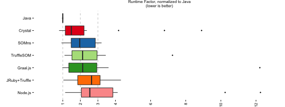
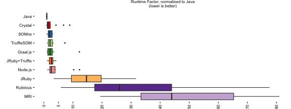
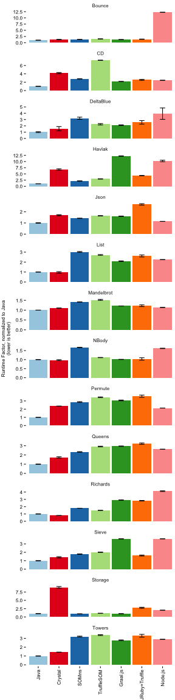
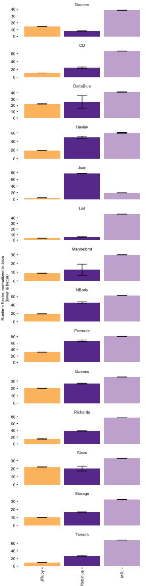

# Performance Results

The last complete run of this benchmark setup yielded the results presented
below. This report was generated on 2016-06-20 19:30:25.

All results are normalized to Java 1.8.0_91. Furthermore, we report peak
performance. This means, the reported measurements are taken after warmup and
compilation of the benchmark code is completed.

## Overview

##### Fast Language Implementations

The following set of language implementations reaches the performance of Java on
our set of benchmarks within a factor of 2 to 3 on average. To allow for a more
detailed assessment of these *fast* language implementations, we exclude slower
ones from the following plot.

##### All Language Implementations

Other language implementations are not necessarily reaching performance similar
to Java on our benchmarks. The following plot include all of the
implementations.

##### Performance Overview Data

The following table contains the numerical representation of the results
depicted above.

<table frame="hsides" rules="groups">
<thead>
<tr class="c ">
  <th>&nbsp;</th>
  <th colspan="5">Runtime Factor over Java</th>
</tr>
 <tr class="c ">
  <th></th>
  <th>geomean</th>
  <th>sd</th>
  <th>min</th>
  <th>max</th>
  <th>median</th>
</tr>
</thead>
<tbody>
<tr class="c ">
  <th class="left">Java</th>
  <td class="right">1.00</td>
  <td class="right">0.00</td>
  <td class="right">1.00</td>
  <td class="right">1.00</td>
  <td class="right">1.00</td>
</tr>
 <tr class="c ">
  <th class="left">Crystal</th>
  <td class="right">1.85</td>
  <td class="right">2.45</td>
  <td class="right">0.79</td>
  <td class="right">8.90</td>
  <td class="right">1.49</td>
</tr>
 <tr class="c ">
  <th class="left">SOMns</th>
  <td class="right">2.00</td>
  <td class="right">0.77</td>
  <td class="right">0.93</td>
  <td class="right">3.21</td>
  <td class="right">1.97</td>
</tr>
 <tr class="c ">
  <th class="left">TruffleSOM</th>
  <td class="right">2.20</td>
  <td class="right">1.58</td>
  <td class="right">1.10</td>
  <td class="right">7.25</td>
  <td class="right">2.13</td>
</tr>
 <tr class="c ">
  <th class="left">Graal.js</th>
  <td class="right">2.23</td>
  <td class="right">2.82</td>
  <td class="right">0.98</td>
  <td class="right">12.22</td>
  <td class="right">2.13</td>
</tr>
 <tr class="c ">
  <th class="left">JRuby+Truffle</th>
  <td class="right">2.36</td>
  <td class="right">0.94</td>
  <td class="right">1.04</td>
  <td class="right">4.31</td>
  <td class="right">2.64</td>
</tr>
 <tr class="c ">
  <th class="left">Node.js</th>
  <td class="right">2.89</td>
  <td class="right">3.33</td>
  <td class="right">1.14</td>
  <td class="right">12.25</td>
  <td class="right">2.54</td>
</tr>
 <tr class="c ">
  <th class="left">JRuby</th>
  <td class="right">12.83</td>
  <td class="right">7.82</td>
  <td class="right">3.36</td>
  <td class="right">31.62</td>
  <td class="right">14.66</td>
</tr>
 <tr class="c ">
  <th class="left">Rubinius</th>
  <td class="right">25.09</td>
  <td class="right">21.52</td>
  <td class="right">5.85</td>
  <td class="right">77.60</td>
  <td class="right">26.02</td>
</tr>
 <tr class="c ">
  <th class="left">MRI</th>
  <td class="right">45.62</td>
  <td class="right">19.48</td>
  <td class="right">19.37</td>
  <td class="right">81.00</td>
  <td class="right">43.98</td>
</tr>
</tbody>
</table>

## Details for all Benchmarks

The following plots show results for each of the benchmarks.

##### Fast Language Implementations

##### Slow Language Implementations

##### Benchmark Results

The following table contains the numerical results for all benchmarks.

<table frame="hsides" rules="groups">
<thead>
<tr class="c ">
  <th>&nbsp;</th>
  <th>&nbsp;</th>
  <th colspan="2">Runtime Factor over Java</th>
</tr>
 <tr class="c ">
  <th></th>
  <th>VM</th>
  <th>geomean</th>
  <th>sd</th>
</tr>
</thead>
<tbody>
<tr class="c ">
  <th class="left">Bounce</th>
  <th class="left">Java</th>
  <td class="right">1.00</td>
  <td class="right">0.03</td>
</tr>
 <tr class="c ">
  <th class="left">&nbsp;</th>
  <th class="left">Crystal</th>
  <td class="right">1.27</td>
  <td class="right">0.08</td>
</tr>
 <tr class="c ">
  <th class="left">&nbsp;</th>
  <th class="left">SOMns</th>
  <td class="right">1.30</td>
  <td class="right">0.02</td>
</tr>
 <tr class="c ">
  <th class="left">&nbsp;</th>
  <th class="left">TruffleSOM</th>
  <td class="right">1.52</td>
  <td class="right">0.03</td>
</tr>
 <tr class="c ">
  <th class="left">&nbsp;</th>
  <th class="left">Graal.js</th>
  <td class="right">1.26</td>
  <td class="right">0.02</td>
</tr>
 <tr class="c ">
  <th class="left">&nbsp;</th>
  <th class="left">JRuby+Truffle</th>
  <td class="right">1.41</td>
  <td class="right">0.06</td>
</tr>
 <tr class="c ">
  <th class="left">&nbsp;</th>
  <th class="left">Node.js</th>
  <td class="right">12.25</td>
  <td class="right">0.01</td>
</tr>
 <tr class="c ">
  <th class="left">&nbsp;</th>
  <th class="left">JRuby</th>
  <td class="right">14.51</td>
  <td class="right">0.08</td>
</tr>
 <tr class="c ">
  <th class="left">&nbsp;</th>
  <th class="left">Rubinius</th>
  <td class="right">8.02</td>
  <td class="right">0.41</td>
</tr>
 <tr class="c ">
  <th class="left">&nbsp;</th>
  <th class="left">MRI</th>
  <td class="right">38.35</td>
  <td class="right">0.01</td>
</tr>
 <tr class="c ">
  <th class="left">CD</th>
  <th class="left">Java</th>
  <td class="right">1.00</td>
  <td class="right">0.03</td>
</tr>
 <tr class="c ">
  <th class="left">&nbsp;</th>
  <th class="left">Crystal</th>
  <td class="right">4.18</td>
  <td class="right">0.14</td>
</tr>
 <tr class="c ">
  <th class="left">&nbsp;</th>
  <th class="left">SOMns</th>
  <td class="right">2.80</td>
  <td class="right">0.03</td>
</tr>
 <tr class="c ">
  <th class="left">&nbsp;</th>
  <th class="left">TruffleSOM</th>
  <td class="right">7.25</td>
  <td class="right">0.04</td>
</tr>
 <tr class="c ">
  <th class="left">&nbsp;</th>
  <th class="left">Graal.js</th>
  <td class="right">2.16</td>
  <td class="right">0.03</td>
</tr>
 <tr class="c ">
  <th class="left">&nbsp;</th>
  <th class="left">JRuby+Truffle</th>
  <td class="right">2.56</td>
  <td class="right">0.11</td>
</tr>
 <tr class="c ">
  <th class="left">&nbsp;</th>
  <th class="left">Node.js</th>
  <td class="right">2.46</td>
  <td class="right">0.01</td>
</tr>
 <tr class="c ">
  <th class="left">&nbsp;</th>
  <th class="left">JRuby</th>
  <td class="right">10.58</td>
  <td class="right">0.04</td>
</tr>
 <tr class="c ">
  <th class="left">&nbsp;</th>
  <th class="left">Rubinius</th>
  <td class="right">23.68</td>
  <td class="right">2.13</td>
</tr>
 <tr class="c ">
  <th class="left">&nbsp;</th>
  <th class="left">MRI</th>
  <td class="right">66.24</td>
  <td class="right">0.16</td>
</tr>
 <tr class="c ">
  <th class="left">DeltaBlue</th>
  <th class="left">Java</th>
  <td class="right">1.00</td>
  <td class="right">0.06</td>
</tr>
 <tr class="c ">
  <th class="left">&nbsp;</th>
  <th class="left">Crystal</th>
  <td class="right">1.55</td>
  <td class="right">0.33</td>
</tr>
 <tr class="c ">
  <th class="left">&nbsp;</th>
  <th class="left">SOMns</th>
  <td class="right">3.20</td>
  <td class="right">0.18</td>
</tr>
 <tr class="c ">
  <th class="left">&nbsp;</th>
  <th class="left">TruffleSOM</th>
  <td class="right">2.25</td>
  <td class="right">0.11</td>
</tr>
 <tr class="c ">
  <th class="left">&nbsp;</th>
  <th class="left">Graal.js</th>
  <td class="right">2.10</td>
  <td class="right">0.06</td>
</tr>
 <tr class="c ">
  <th class="left">&nbsp;</th>
  <th class="left">JRuby+Truffle</th>
  <td class="right">2.55</td>
  <td class="right">0.28</td>
</tr>
 <tr class="c ">
  <th class="left">&nbsp;</th>
  <th class="left">Node.js</th>
  <td class="right">3.93</td>
  <td class="right">0.90</td>
</tr>
 <tr class="c ">
  <th class="left">&nbsp;</th>
  <th class="left">JRuby</th>
  <td class="right">22.61</td>
  <td class="right">0.72</td>
</tr>
 <tr class="c ">
  <th class="left">&nbsp;</th>
  <th class="left">Rubinius</th>
  <td class="right">25.46</td>
  <td class="right">10.01</td>
</tr>
 <tr class="c ">
  <th class="left">&nbsp;</th>
  <th class="left">MRI</th>
  <td class="right">41.08</td>
  <td class="right">0.58</td>
</tr>
 <tr class="c ">
  <th class="left">Havlak</th>
  <th class="left">Java</th>
  <td class="right">1.00</td>
  <td class="right">0.03</td>
</tr>
 <tr class="c ">
  <th class="left">&nbsp;</th>
  <th class="left">Crystal</th>
  <td class="right">6.79</td>
  <td class="right">0.27</td>
</tr>
 <tr class="c ">
  <th class="left">&nbsp;</th>
  <th class="left">SOMns</th>
  <td class="right">2.14</td>
  <td class="right">0.08</td>
</tr>
 <tr class="c ">
  <th class="left">&nbsp;</th>
  <th class="left">TruffleSOM</th>
  <td class="right">2.96</td>
  <td class="right">0.08</td>
</tr>
 <tr class="c ">
  <th class="left">&nbsp;</th>
  <th class="left">Graal.js</th>
  <td class="right">12.22</td>
  <td class="right">0.09</td>
</tr>
 <tr class="c ">
  <th class="left">&nbsp;</th>
  <th class="left">JRuby+Truffle</th>
  <td class="right">4.31</td>
  <td class="right">0.07</td>
</tr>
 <tr class="c ">
  <th class="left">&nbsp;</th>
  <th class="left">Node.js</th>
  <td class="right">10.24</td>
  <td class="right">0.30</td>
</tr>
 <tr class="c ">
  <th class="left">&nbsp;</th>
  <th class="left">JRuby</th>
  <td class="right">18.68</td>
  <td class="right">0.12</td>
</tr>
 <tr class="c ">
  <th class="left">&nbsp;</th>
  <th class="left">Rubinius</th>
  <td class="right">49.65</td>
  <td class="right">2.48</td>
</tr>
 <tr class="c ">
  <th class="left">&nbsp;</th>
  <th class="left">MRI</th>
  <td class="right">59.91</td>
  <td class="right">0.86</td>
</tr>
 <tr class="c ">
  <th class="left">Json</th>
  <th class="left">Java</th>
  <td class="right">1.00</td>
  <td class="right">0.02</td>
</tr>
 <tr class="c ">
  <th class="left">&nbsp;</th>
  <th class="left">Crystal</th>
  <td class="right">1.70</td>
  <td class="right">0.05</td>
</tr>
 <tr class="c ">
  <th class="left">&nbsp;</th>
  <th class="left">SOMns</th>
  <td class="right">1.42</td>
  <td class="right">0.02</td>
</tr>
 <tr class="c ">
  <th class="left">&nbsp;</th>
  <th class="left">TruffleSOM</th>
  <td class="right">1.64</td>
  <td class="right">0.02</td>
</tr>
 <tr class="c ">
  <th class="left">&nbsp;</th>
  <th class="left">Graal.js</th>
  <td class="right">1.60</td>
  <td class="right">0.02</td>
</tr>
 <tr class="c ">
  <th class="left">&nbsp;</th>
  <th class="left">JRuby+Truffle</th>
  <td class="right">2.66</td>
  <td class="right">0.07</td>
</tr>
 <tr class="c ">
  <th class="left">&nbsp;</th>
  <th class="left">Node.js</th>
  <td class="right">1.14</td>
  <td class="right">0.00</td>
</tr>
 <tr class="c ">
  <th class="left">&nbsp;</th>
  <th class="left">JRuby</th>
  <td class="right">4.79</td>
  <td class="right">0.03</td>
</tr>
 <tr class="c ">
  <th class="left">&nbsp;</th>
  <th class="left">Rubinius</th>
  <td class="right">77.60</td>
  <td class="right">0.36</td>
</tr>
 <tr class="c ">
  <th class="left">&nbsp;</th>
  <th class="left">MRI</th>
  <td class="right">19.37</td>
  <td class="right">0.37</td>
</tr>
 <tr class="c ">
  <th class="left">List</th>
  <th class="left">Java</th>
  <td class="right">1.00</td>
  <td class="right">0.01</td>
</tr>
 <tr class="c ">
  <th class="left">&nbsp;</th>
  <th class="left">Crystal</th>
  <td class="right">0.96</td>
  <td class="right">0.08</td>
</tr>
 <tr class="c ">
  <th class="left">&nbsp;</th>
  <th class="left">SOMns</th>
  <td class="right">3.02</td>
  <td class="right">0.04</td>
</tr>
 <tr class="c ">
  <th class="left">&nbsp;</th>
  <th class="left">TruffleSOM</th>
  <td class="right">2.72</td>
  <td class="right">0.04</td>
</tr>
 <tr class="c ">
  <th class="left">&nbsp;</th>
  <th class="left">Graal.js</th>
  <td class="right">2.09</td>
  <td class="right">0.04</td>
</tr>
 <tr class="c ">
  <th class="left">&nbsp;</th>
  <th class="left">JRuby+Truffle</th>
  <td class="right">2.62</td>
  <td class="right">0.10</td>
</tr>
 <tr class="c ">
  <th class="left">&nbsp;</th>
  <th class="left">Node.js</th>
  <td class="right">2.25</td>
  <td class="right">0.00</td>
</tr>
 <tr class="c ">
  <th class="left">&nbsp;</th>
  <th class="left">JRuby</th>
  <td class="right">3.36</td>
  <td class="right">0.03</td>
</tr>
 <tr class="c ">
  <th class="left">&nbsp;</th>
  <th class="left">Rubinius</th>
  <td class="right">5.85</td>
  <td class="right">0.73</td>
</tr>
 <tr class="c ">
  <th class="left">&nbsp;</th>
  <th class="left">MRI</th>
  <td class="right">46.87</td>
  <td class="right">0.02</td>
</tr>
 <tr class="c ">
  <th class="left">Mandelbrot</th>
  <th class="left">Java</th>
  <td class="right">1.00</td>
  <td class="right">0.00</td>
</tr>
 <tr class="c ">
  <th class="left">&nbsp;</th>
  <th class="left">Crystal</th>
  <td class="right">1.10</td>
  <td class="right">0.00</td>
</tr>
 <tr class="c ">
  <th class="left">&nbsp;</th>
  <th class="left">SOMns</th>
  <td class="right">1.41</td>
  <td class="right">0.00</td>
</tr>
 <tr class="c ">
  <th class="left">&nbsp;</th>
  <th class="left">TruffleSOM</th>
  <td class="right">1.52</td>
  <td class="right">0.02</td>
</tr>
 <tr class="c ">
  <th class="left">&nbsp;</th>
  <th class="left">Graal.js</th>
  <td class="right">1.21</td>
  <td class="right">0.00</td>
</tr>
 <tr class="c ">
  <th class="left">&nbsp;</th>
  <th class="left">JRuby+Truffle</th>
  <td class="right">1.22</td>
  <td class="right">0.04</td>
</tr>
 <tr class="c ">
  <th class="left">&nbsp;</th>
  <th class="left">Node.js</th>
  <td class="right">1.14</td>
  <td class="right">0.00</td>
</tr>
 <tr class="c ">
  <th class="left">&nbsp;</th>
  <th class="left">JRuby</th>
  <td class="right">8.83</td>
  <td class="right">0.05</td>
</tr>
 <tr class="c ">
  <th class="left">&nbsp;</th>
  <th class="left">Rubinius</th>
  <td class="right">12.83</td>
  <td class="right">6.34</td>
</tr>
 <tr class="c ">
  <th class="left">&nbsp;</th>
  <th class="left">MRI</th>
  <td class="right">29.95</td>
  <td class="right">0.01</td>
</tr>
 <tr class="c ">
  <th class="left">NBody</th>
  <th class="left">Java</th>
  <td class="right">1.00</td>
  <td class="right">0.00</td>
</tr>
 <tr class="c ">
  <th class="left">&nbsp;</th>
  <th class="left">Crystal</th>
  <td class="right">0.97</td>
  <td class="right">0.03</td>
</tr>
 <tr class="c ">
  <th class="left">&nbsp;</th>
  <th class="left">SOMns</th>
  <td class="right">1.67</td>
  <td class="right">0.01</td>
</tr>
 <tr class="c ">
  <th class="left">&nbsp;</th>
  <th class="left">TruffleSOM</th>
  <td class="right">1.11</td>
  <td class="right">0.01</td>
</tr>
 <tr class="c ">
  <th class="left">&nbsp;</th>
  <th class="left">Graal.js</th>
  <td class="right">1.01</td>
  <td class="right">0.01</td>
</tr>
 <tr class="c ">
  <th class="left">&nbsp;</th>
  <th class="left">JRuby+Truffle</th>
  <td class="right">1.04</td>
  <td class="right">0.07</td>
</tr>
 <tr class="c ">
  <th class="left">&nbsp;</th>
  <th class="left">Node.js</th>
  <td class="right">1.62</td>
  <td class="right">0.01</td>
</tr>
 <tr class="c ">
  <th class="left">&nbsp;</th>
  <th class="left">JRuby</th>
  <td class="right">18.66</td>
  <td class="right">0.07</td>
</tr>
 <tr class="c ">
  <th class="left">&nbsp;</th>
  <th class="left">Rubinius</th>
  <td class="right">45.95</td>
  <td class="right">1.60</td>
</tr>
 <tr class="c ">
  <th class="left">&nbsp;</th>
  <th class="left">MRI</th>
  <td class="right">62.50</td>
  <td class="right">0.04</td>
</tr>
 <tr class="c ">
  <th class="left">Permute</th>
  <th class="left">Java</th>
  <td class="right">1.00</td>
  <td class="right">0.00</td>
</tr>
 <tr class="c ">
  <th class="left">&nbsp;</th>
  <th class="left">Crystal</th>
  <td class="right">2.37</td>
  <td class="right">0.01</td>
</tr>
 <tr class="c ">
  <th class="left">&nbsp;</th>
  <th class="left">SOMns</th>
  <td class="right">2.87</td>
  <td class="right">0.04</td>
</tr>
 <tr class="c ">
  <th class="left">&nbsp;</th>
  <th class="left">TruffleSOM</th>
  <td class="right">3.45</td>
  <td class="right">0.05</td>
</tr>
 <tr class="c ">
  <th class="left">&nbsp;</th>
  <th class="left">Graal.js</th>
  <td class="right">3.06</td>
  <td class="right">0.05</td>
</tr>
 <tr class="c ">
  <th class="left">&nbsp;</th>
  <th class="left">JRuby+Truffle</th>
  <td class="right">3.58</td>
  <td class="right">0.13</td>
</tr>
 <tr class="c ">
  <th class="left">&nbsp;</th>
  <th class="left">Node.js</th>
  <td class="right">2.13</td>
  <td class="right">0.00</td>
</tr>
 <tr class="c ">
  <th class="left">&nbsp;</th>
  <th class="left">JRuby</th>
  <td class="right">31.62</td>
  <td class="right">0.10</td>
</tr>
 <tr class="c ">
  <th class="left">&nbsp;</th>
  <th class="left">Rubinius</th>
  <td class="right">67.08</td>
  <td class="right">2.44</td>
</tr>
 <tr class="c ">
  <th class="left">&nbsp;</th>
  <th class="left">MRI</th>
  <td class="right">81.00</td>
  <td class="right">0.09</td>
</tr>
 <tr class="c ">
  <th class="left">Queens</th>
  <th class="left">Java</th>
  <td class="right">1.00</td>
  <td class="right">0.02</td>
</tr>
 <tr class="c ">
  <th class="left">&nbsp;</th>
  <th class="left">Crystal</th>
  <td class="right">1.74</td>
  <td class="right">0.07</td>
</tr>
 <tr class="c ">
  <th class="left">&nbsp;</th>
  <th class="left">SOMns</th>
  <td class="right">2.33</td>
  <td class="right">0.03</td>
</tr>
 <tr class="c ">
  <th class="left">&nbsp;</th>
  <th class="left">TruffleSOM</th>
  <td class="right">2.92</td>
  <td class="right">0.04</td>
</tr>
 <tr class="c ">
  <th class="left">&nbsp;</th>
  <th class="left">Graal.js</th>
  <td class="right">2.95</td>
  <td class="right">0.02</td>
</tr>
 <tr class="c ">
  <th class="left">&nbsp;</th>
  <th class="left">JRuby+Truffle</th>
  <td class="right">3.23</td>
  <td class="right">0.08</td>
</tr>
 <tr class="c ">
  <th class="left">&nbsp;</th>
  <th class="left">Node.js</th>
  <td class="right">2.62</td>
  <td class="right">0.00</td>
</tr>
 <tr class="c ">
  <th class="left">&nbsp;</th>
  <th class="left">JRuby</th>
  <td class="right">20.07</td>
  <td class="right">0.14</td>
</tr>
 <tr class="c ">
  <th class="left">&nbsp;</th>
  <th class="left">Rubinius</th>
  <td class="right">26.58</td>
  <td class="right">0.56</td>
</tr>
 <tr class="c ">
  <th class="left">&nbsp;</th>
  <th class="left">MRI</th>
  <td class="right">35.49</td>
  <td class="right">0.01</td>
</tr>
 <tr class="c ">
  <th class="left">Richards</th>
  <th class="left">Java</th>
  <td class="right">1.00</td>
  <td class="right">0.01</td>
</tr>
 <tr class="c ">
  <th class="left">&nbsp;</th>
  <th class="left">Crystal</th>
  <td class="right">0.79</td>
  <td class="right">0.00</td>
</tr>
 <tr class="c ">
  <th class="left">&nbsp;</th>
  <th class="left">SOMns</th>
  <td class="right">1.78</td>
  <td class="right">0.00</td>
</tr>
 <tr class="c ">
  <th class="left">&nbsp;</th>
  <th class="left">TruffleSOM</th>
  <td class="right">1.49</td>
  <td class="right">0.00</td>
</tr>
 <tr class="c ">
  <th class="left">&nbsp;</th>
  <th class="left">Graal.js</th>
  <td class="right">2.91</td>
  <td class="right">0.02</td>
</tr>
 <tr class="c ">
  <th class="left">&nbsp;</th>
  <th class="left">JRuby+Truffle</th>
  <td class="right">2.81</td>
  <td class="right">0.03</td>
</tr>
 <tr class="c ">
  <th class="left">&nbsp;</th>
  <th class="left">Node.js</th>
  <td class="right">4.12</td>
  <td class="right">0.05</td>
</tr>
 <tr class="c ">
  <th class="left">&nbsp;</th>
  <th class="left">JRuby</th>
  <td class="right">14.81</td>
  <td class="right">1.11</td>
</tr>
 <tr class="c ">
  <th class="left">&nbsp;</th>
  <th class="left">Rubinius</th>
  <td class="right">38.01</td>
  <td class="right">0.75</td>
</tr>
 <tr class="c ">
  <th class="left">&nbsp;</th>
  <th class="left">MRI</th>
  <td class="right">76.90</td>
  <td class="right">0.13</td>
</tr>
 <tr class="c ">
  <th class="left">Sieve</th>
  <th class="left">Java</th>
  <td class="right">1.00</td>
  <td class="right">0.02</td>
</tr>
 <tr class="c ">
  <th class="left">&nbsp;</th>
  <th class="left">Crystal</th>
  <td class="right">1.41</td>
  <td class="right">0.07</td>
</tr>
 <tr class="c ">
  <th class="left">&nbsp;</th>
  <th class="left">SOMns</th>
  <td class="right">1.79</td>
  <td class="right">0.02</td>
</tr>
 <tr class="c ">
  <th class="left">&nbsp;</th>
  <th class="left">TruffleSOM</th>
  <td class="right">2.01</td>
  <td class="right">0.03</td>
</tr>
 <tr class="c ">
  <th class="left">&nbsp;</th>
  <th class="left">Graal.js</th>
  <td class="right">3.61</td>
  <td class="right">0.02</td>
</tr>
 <tr class="c ">
  <th class="left">&nbsp;</th>
  <th class="left">JRuby+Truffle</th>
  <td class="right">1.62</td>
  <td class="right">0.06</td>
</tr>
 <tr class="c ">
  <th class="left">&nbsp;</th>
  <th class="left">Node.js</th>
  <td class="right">3.61</td>
  <td class="right">0.00</td>
</tr>
 <tr class="c ">
  <th class="left">&nbsp;</th>
  <th class="left">JRuby</th>
  <td class="right">22.14</td>
  <td class="right">0.06</td>
</tr>
 <tr class="c ">
  <th class="left">&nbsp;</th>
  <th class="left">Rubinius</th>
  <td class="right">20.11</td>
  <td class="right">3.02</td>
</tr>
 <tr class="c ">
  <th class="left">&nbsp;</th>
  <th class="left">MRI</th>
  <td class="right">32.69</td>
  <td class="right">0.06</td>
</tr>
 <tr class="c ">
  <th class="left">Storage</th>
  <th class="left">Java</th>
  <td class="right">1.00</td>
  <td class="right">0.02</td>
</tr>
 <tr class="c ">
  <th class="left">&nbsp;</th>
  <th class="left">Crystal</th>
  <td class="right">8.90</td>
  <td class="right">0.25</td>
</tr>
 <tr class="c ">
  <th class="left">&nbsp;</th>
  <th class="left">SOMns</th>
  <td class="right">0.93</td>
  <td class="right">0.02</td>
</tr>
 <tr class="c ">
  <th class="left">&nbsp;</th>
  <th class="left">TruffleSOM</th>
  <td class="right">1.10</td>
  <td class="right">0.02</td>
</tr>
 <tr class="c ">
  <th class="left">&nbsp;</th>
  <th class="left">Graal.js</th>
  <td class="right">0.98</td>
  <td class="right">0.02</td>
</tr>
 <tr class="c ">
  <th class="left">&nbsp;</th>
  <th class="left">JRuby+Truffle</th>
  <td class="right">2.77</td>
  <td class="right">0.16</td>
</tr>
 <tr class="c ">
  <th class="left">&nbsp;</th>
  <th class="left">Node.js</th>
  <td class="right">2.03</td>
  <td class="right">0.00</td>
</tr>
 <tr class="c ">
  <th class="left">&nbsp;</th>
  <th class="left">JRuby</th>
  <td class="right">9.77</td>
  <td class="right">0.06</td>
</tr>
 <tr class="c ">
  <th class="left">&nbsp;</th>
  <th class="left">Rubinius</th>
  <td class="right">16.59</td>
  <td class="right">0.26</td>
</tr>
 <tr class="c ">
  <th class="left">&nbsp;</th>
  <th class="left">MRI</th>
  <td class="right">32.15</td>
  <td class="right">0.32</td>
</tr>
 <tr class="c ">
  <th class="left">Towers</th>
  <th class="left">Java</th>
  <td class="right">1.00</td>
  <td class="right">0.02</td>
</tr>
 <tr class="c ">
  <th class="left">&nbsp;</th>
  <th class="left">Crystal</th>
  <td class="right">1.43</td>
  <td class="right">0.00</td>
</tr>
 <tr class="c ">
  <th class="left">&nbsp;</th>
  <th class="left">SOMns</th>
  <td class="right">3.21</td>
  <td class="right">0.04</td>
</tr>
 <tr class="c ">
  <th class="left">&nbsp;</th>
  <th class="left">TruffleSOM</th>
  <td class="right">3.37</td>
  <td class="right">0.05</td>
</tr>
 <tr class="c ">
  <th class="left">&nbsp;</th>
  <th class="left">Graal.js</th>
  <td class="right">2.79</td>
  <td class="right">0.04</td>
</tr>
 <tr class="c ">
  <th class="left">&nbsp;</th>
  <th class="left">JRuby+Truffle</th>
  <td class="right">3.29</td>
  <td class="right">0.16</td>
</tr>
 <tr class="c ">
  <th class="left">&nbsp;</th>
  <th class="left">Node.js</th>
  <td class="right">2.89</td>
  <td class="right">0.00</td>
</tr>
 <tr class="c ">
  <th class="left">&nbsp;</th>
  <th class="left">JRuby</th>
  <td class="right">9.39</td>
  <td class="right">0.05</td>
</tr>
 <tr class="c ">
  <th class="left">&nbsp;</th>
  <th class="left">Rubinius</th>
  <td class="right">26.90</td>
  <td class="right">1.29</td>
</tr>
 <tr class="c ">
  <th class="left">&nbsp;</th>
  <th class="left">MRI</th>
  <td class="right">68.50</td>
  <td class="right">0.03</td>
</tr>
</tbody>
</table>
